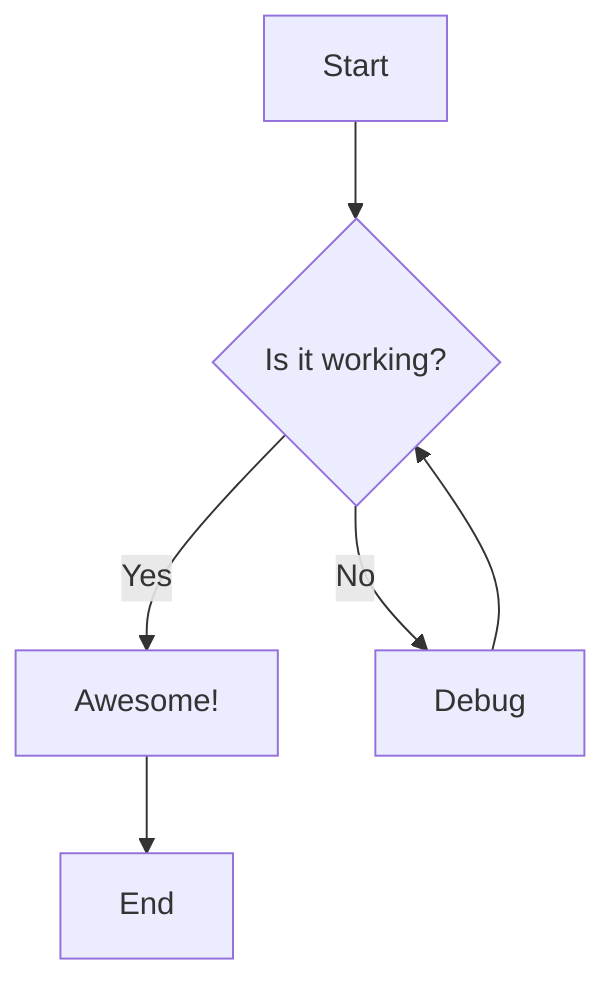
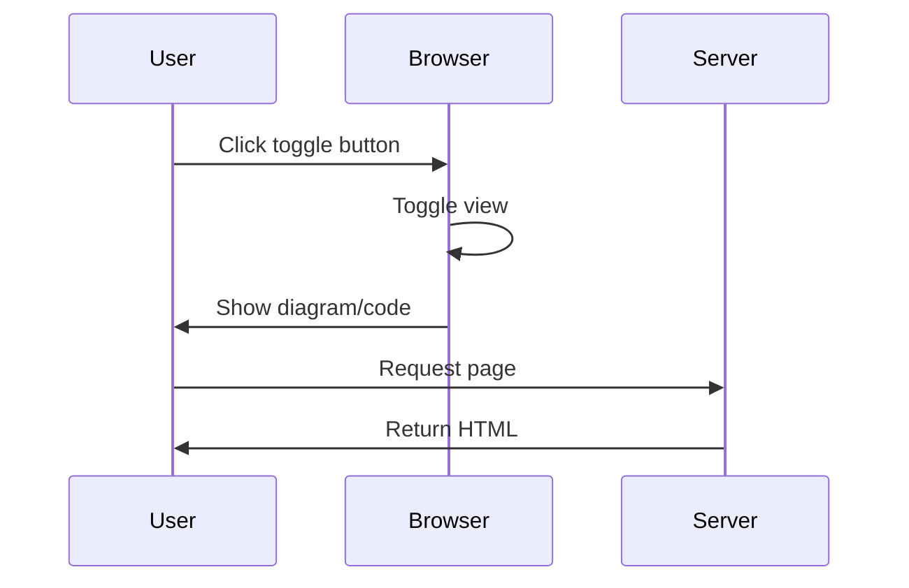
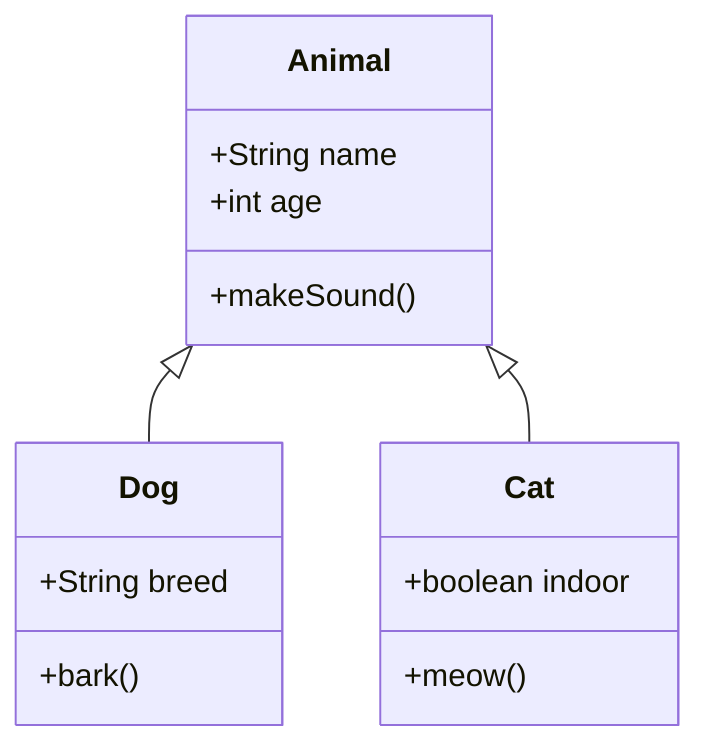

This post demonstrates Mermaid.js diagram support with a toggle between diagram and code views.

## Simple Flowchart

## Sequence Diagram

## Class Diagram

Each diagram above has a toggle button in the top-right corner. Click "View Code" to see the Mermaid syntax, or "View Diagram" to see the rendered visualization.
