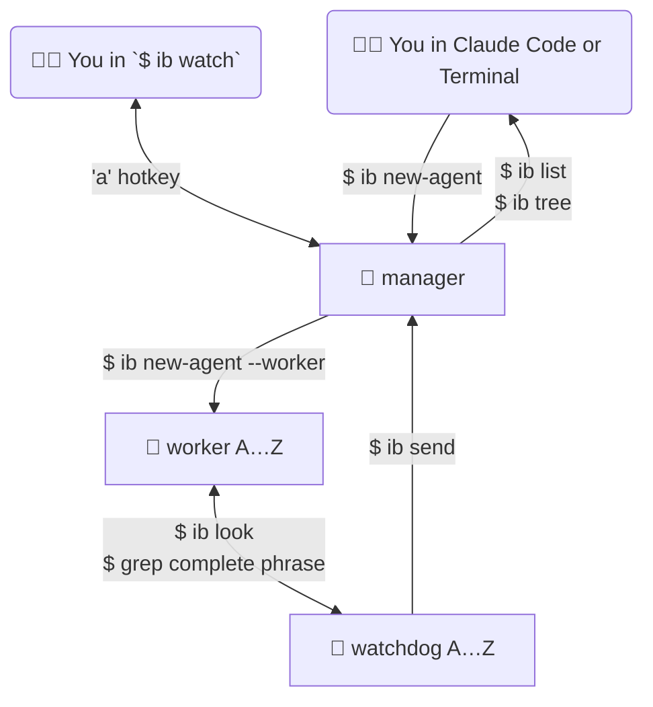

+++
title = "Itty Bitty AI Agent Orchestrator"
date = "2026-01-16T10:27:10+0000"
slug = "itty-bitty-ai-agent-orchestrator"
type = "post"
+++

If you haven't heard of [Gas Town](https://github.com/steveyegge/gastown), you're in for an proper adventure. I read through [Steve's ~~introduction~~ manifesto](https://steve-yegge.medium.com/welcome-to-gas-town-4f25ee16dd04), and while I loved the vision, the scale was overwhelming. Want to wrap your head around it? welcome to the Mayor, rigs, convoys, polecats, crew, hooks, dogs, and so many more metaphors and tv/movie references. He's not messing around, Gas Town requires sqlite for holding state, uses [beads](https://github.com/steveyegge/beads) for issue tracking and state management, supports pluggable AI runtimes.

And then of course [there's this bit](https://steve-yegge.medium.com/welcome-to-gas-town-4f25ee16dd04#9df3)... "Gas Town is also expensive as hell. You won’t like Gas Town if you ever have to think, even for a moment, about where money comes from."

And so, in proper self-nerd-snipe fashion, I thought to myself "surely there's an easier (and less expensive) way to do multi-agent AI?!", and [`ittybitty`](https://github.com/adamwulf/ittybitty) was born.

`ittybitty` lets you spawn multiple `claude` instances in virtual terminals in `tmux`, and these claude instances can also spawn more claude instances to help them accomplish their task. I wish I'd had it late last year, when I ran parallel Claude Code Web instances to research competitors, write reports, and cite sources. It was slow and painful, and it's the perfect task for parallel AI agents with `ittybitty`.

A look at `ittybitty`'s TUI in action: agent list on top, claude session on left, agent log on right, key commands on the bottom.




## Quickstart

Want to just jump in? Clone https://github.com/adamwulf/ittybitty add it to your `$PATH`. Then, from any git repo on your system:

``` bash
# start a new agent
ib new-agent --name hellobot --model opus "say hello, and then wait for instructions"

# show the agent's status
ib list

# agents can talk to each other
ib new-agent --name friendbot --model opus "say hello to hellobot by sending them a message"

# see their claude session history
ib look friendbot

# use the interactive dashboard (Ctrl+c to exit)
ib watch

# there's gotta be a better word for this than 'kill'?
ib kill hellobot
ib kill friendbot

# read the help to see what's possible
ib help
```

Agents run per-repository, so if you spawn agents in your website repo, they won't see agents in your product repo, for instance.

Want more detail? Here we go!

## My Goals

I use claude code _a lot_. It's always running while I code, either working on a task or helping me debug. I use it as a personal assistant. I use it to run long-running web research tasks. I use it went I'm coding, and when I'm not coding, and everything in-between.

I often want to run multiple instances of `claude` in git worktrees, but don't want to open/close/merge the worktrees myself. I basically want a normal `claude` instance, but one that can spawn and manage many other `claude` instances too. I want 10 agents to _feel_ like 1 agent, which means I need to have easy visibility into what the team is doing.

## What were my constraints?

I love projects with constraints, that's where the creativity happens, and I set myself some stringent constraints:

### No dependencies

Gas Town requires you to buy into using beads with sqlite as the task coordination layer, and I want a tool that fits into _my_ workflow instead of me fitting into _its_ workflow. That means, no `beads`, no `sqlite`. It should be as close to "just claude" as is possible to get. And I got very close - the only required dependency that doesn't come with macOS is `tmux`.

I went further - no build scripts. "It works out of the box" → Nope, I don't even want a box. It should work while I build it and should work when you download it, those should be the same thing. That means _pure bash_.

### No YOLO

If your tool requires yolo mode, it's a non-starter for me. I need a tool that I can run without needing to spin up a container and still have control over what it can and can't do.


### Easy to understand

The mental model is "it's just `claude`, and you can make lots of them." No metaphors, no stories, no complexity, just AI agents that you tell what to do.


### Agents can make agents

_Yo dawg, I heard you like agents._ Agents should be able to spin up helper agents to run tasks in parallel. You should also be confident they won't [fork bomb](https://en.wikipedia.org/wiki/Fork_bomb) your system.


### Agents can talk to each other

Sometimes agents get stuck, or don't have the full information they need. Or, after spawning a team of 6 agents, I might remember another core requirement, and I don't want to manually message each agent that might be working on it. I should tell the top manager of a task, and it should tell all of its workers that need to know.

### User visibility

I should be able to quickly see how many agents are running, which agents report to which other agents. I want to see their `claude` session history. I should see when an agent tries to use a denied tool and what that tool is incase I want to adjust my pre-approved tool list.


### Staying in control

If I'm going to build a system where an AI can spawn other AIs, I need to have an escape hatch in case _too many_ AIs get spawned. I want two controls: the "oops button" that will immediately close down all running AIs; in ittybitty, this is `ib nuke`. I also want to set a max limit on the number of agents that can be running at any one time. If one of the agents tries to create a new agent, I want it to be rejected if the system is already at the cap.


### Command line interface

This is an extension of the [No dependencies](#no-dependencies) requirement, I don't want to have to use a different tool in order use this tool. It should run in the command line - both the individual commands themselves, as well as a dashboard showing active status.


### Worktree separation

As I was building this, I discovered that teh agents don't quite know how to use git worktrees effectively. Their default is to use git fetch when trying to see other agent's work, even though every agent is already working in a local worktree. Since agents can see which other agents are running, they can discover where on disk those other agent's worktrees are, so instead of using git tools to see diffs between branches, agents were `cd`ing into each others workspaces and forgetting where their 'home' workspace was. The tool needs to enforce boundaries between agents so that they don't wander outside their worktree and start stepping on each other's toes.


### Automatic notifications

The system should somehow monitor agent status so that agents that are stuck and get unstuck, and agents that are complete can have their manager's auto-notified without needing to remember to notify on their own. When an agent completed its work, its manager should know immediately without needing to burn tokens polling its status.


### Minimal steps to get started

I wanted to build something that anyone could download and start using with zero setup. I don't want to build a monolithic system that takes non-trivial setup time, I wanted something _simple_ that could be immediately useful.


## What is an `ittybitty` Agent?

An agent in `ittybitty` is a full claude code instance running inside of tmux. Agents can be either Managers or Workers. The primary difference is that Managers can spawn other agents, including other Managers. Workers cannot spawn other agents.

Here are the steps that ittybitty goes through to launch an agent:

### How are agents created?

1. Before claude is launched, an agent id is generated (or `ib new-agent --name name-here`)
2. a git worktree is created at `your-repo/.ittybitty/agents/[agent-id]/repo` at a new branch `agent/[agent-id]`.
3. `.claude/settings.local.json` is written into the worktree with the contents of the main repo's `settings.local.json` (if any), plus any added tools configured for agents in `.ittybitty.json`, plus a few required tools like `Read`, `Write`, `ib`, and `git`
4. `claude` is launched into a new `tmux` session
5. `ib look [agent-id]` is used to determine if "do you trust this workspace?" or similar prompts are showing, and then they are automatically accepted by sending key commands to `tmux`
6. After `claude` has confirmed to be launched and awaiting input, the initial agent's prompt is sent, which includes brief description of how `ittybitty` works, if it is a Manager or Worker, and the user's prompt.


### How are tools pre-approved only without YOLO?

`PreToolUse`, `Stop`, and `PermissionRequest` hooks are added to the `.claude/local.settings.json` in the agent's worktree. These are set to the commands `ib hook-check-path [agent-id]`, `ib hook-status [agent-id]`, and `ib hook-permission-denied [agent-id]` respectively. These process the hook input to auto-deny new tool requests, and auto-deny any paths that would move the agent into the main repo's path or another agent's path.

The `Stop` hook is a special case, this is used to either:

1. If the agent output "WAITING" or "I HAVE COMPLETED THE GOAL", then notify the agent's manager (if any) of the new status.
2. If neither of those phrases were mentioned, then nudge the agent to continue working, and remind it that it must say one of those two messages when it finishes its output or if it needs help from its manager.


## How is agent work merged?

Since all agents work in their own worktrees, each agent also has its own git branch. Worktrees exist within your existing local git repository, so no push or fetch is required to see their work. You can `git merge agent/[agent-id]` to merge their work into your current branch.

If you merge using the normal `git merge` flow, then the agent will remain alive and its claude session active. If you want to merge their work and close down the agent at the same time, you can use `ib merge [agent-id]` instead. This will merge their work into your current branch, and will also teardown the tmux and claude session, and will archive the claude and agent logs to `.ittybitty/archive/[datetime]-[agent-id]`.


### Can `claude` use `ittybitty`?

Yes! Claude (running as an agent in tmux) can use `ib` commands just like you can. For all `ib` commands, the active agent-id can be inferred based on the current working directory of `ib`. If the `cwd` is in a git worktree in `.ittybitty/agents/`, then that agent id is inferred. This way, agents don't need to remember to 'sign' their messages to each other.

This also let's `ib` react slightly differently to agents than it does to you. Agents are not allowed to use `ib config set` for instance, which, if allowed, would allow agents to increase the max agent limit.


### How do agents send messages to each other?

The command `ib send [agent-id] [message]` will send a message to the agent with the specified id. This is done by iterating through tmux sessions to find the agent that matches the [agent-id], and then sending the input message followed by the Enter key. The message is prefixed with "[sent by agent (agent-id)]:" so that its clear to the recieving agent who sent the message.


## What's the workflow look like?

Below you can see how you and/or your primary claude interface can spawn and interact with `ittybitty` agents.



The diagram above shows how control and information flow as you spawn agents. If you use `ib watch`, you'll get realtime updates on the status and claude session of your agents. If you'd prefer to stay in the command line, or to integrate with other tools, you can call `ib new-agent "your prompt"` directly, and then monitor the agent with `ib look`, `ib list`, and `ib tree`. When you're ready to merge, inspect its git state with `ib status`, `ib diff`, and `ib merge-check`, before finally merging its changes with `ib merge`, or discarding its changes with `ib kill`.
